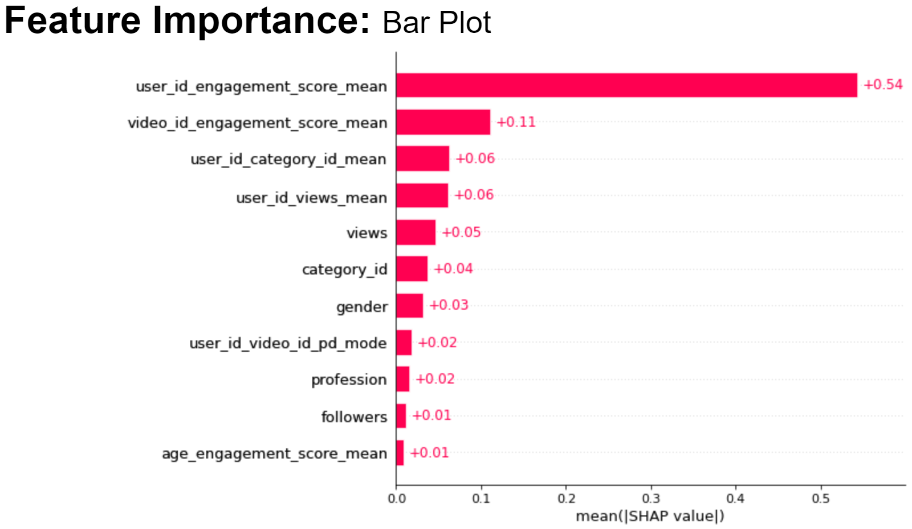

# Analytics-Vidhya-Jobathon-Feb2022
predicting customer video engagement score 

**Business Objective**: 

● Custom video recommendations to improve user experience and
there by user engagement.

**Technical Objective**:

● Predict engagement score of videos.

--> Engagement prediction to improve better content recommendation.
--> Which content is to be recommended to a larger audience.

**Model Architecture**:

**Feature Engineering**:

**Model Training**:

**Model Metrics**:

**XAI- Feature importance BeeSwarm shap plot**: Which features are more important to predict engagement score 

**XAI- Feature importance Bar plot**: 

